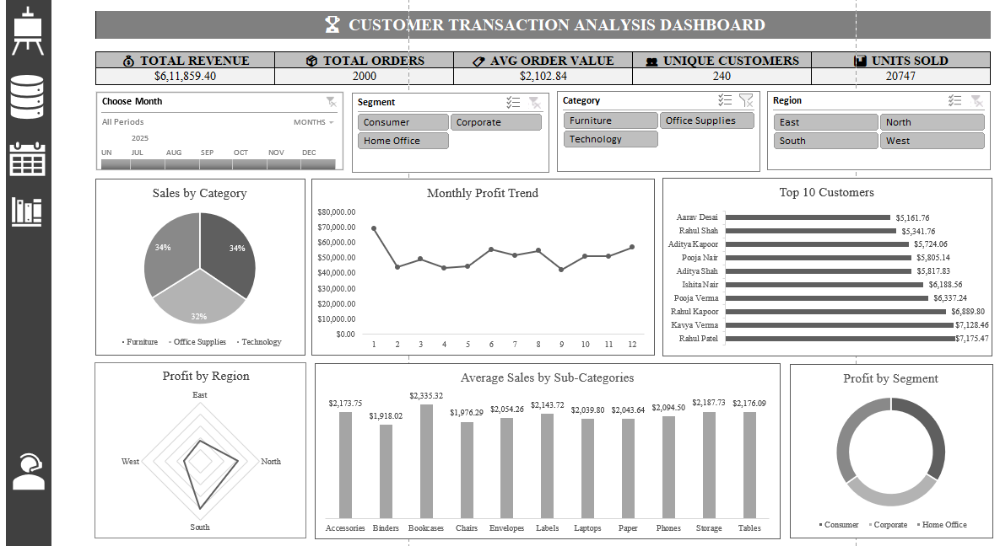

# 📊 Business Intelligence Sales Dashboard


> An interactive Excel-based Business Intelligence dashboard providing end-to-end visibility into sales performance, customer profitability, regional distribution, and category-level insights.

---

## 📸 Dashboard Preview



---

## 📌 Overview

This project is a fully interactive **Business Intelligence Sales Dashboard** built in Microsoft Excel. It consolidates 2,000 sales transactions into a single, clean view — enabling data-driven decision-making across segments, regions, and product categories.

---

## 🔢 Key Metrics at a Glance

| Metric | Value |
|---|---|
| 💰 Total Revenue | $6,11,859.40 |
| 📦 Total Orders | 2,000 |
| 🏷️ Avg Order Value | $2,102.84 |
| 👥 Unique Customers | 240 |
| 📊 Units Sold | 20,747 |

---

## 📊 Dashboard Components

### 1. 🥧 Sales by Categories
A pie chart breaking down revenue contribution across three major categories:
- **Furniture** — 34%
- **Office Supplies** — 32%
- **Technology** — 34%

### 2. 📈 Monthly Sales Trend
A line chart displaying month-over-month sales performance across the full year (Jan–Dec), highlighting seasonal peaks and troughs.

### 3. 🏆 Top 10 Profitable Customers
A ranked horizontal bar chart showcasing the highest-value customers by profit contribution, topped by **Rahul Patel** ($7,175.47) and **Kavya Verma** ($7,128.46).

### 4. 🕸️ Unit Sold by Region
A radar/spider chart comparing unit sales volume across four regions:
- East · West · North · South

### 5. 📊 Avg Profit vs Sales by Sub-Category
A grouped bar chart comparing average sales and average profit for each sub-category (Accessories, Binders, Bookcases, Chairs, Envelopes, Labels, Laptops, Paper, Phones, Storage, Tables).

### 6. 🍩 Profit by Segment
A donut chart visualizing profit distribution across customer segments:
- **Consumer** · **Corporate** · **Home Office**

---

## 🎛️ Interactive Filters (Slicers)

The dashboard supports dynamic filtering using Excel slicers:

| Filter | Options |
|---|---|
| 📅 Order Date | Timeline slicer (by Month) |
| 👤 Segment | Consumer · Corporate · Home Office |
| 🗂️ Category | Furniture · Office Supplies · Technology |
| 🌍 Region | East · North · South · West |

All charts update in real-time when filters are applied.

---

## 📁 File Structure

```
📦 BI-Sales-Dashboard
 ┣ 📊 RenseeGajipara_Excel_Dashboard.xlsx   # Main Excel workbook
 ┃  ┣ 📋 Dashboard                          # Interactive dashboard sheet
 ┃  ┗ 🗄️  Raw Data                          # Source transaction data (2,000 rows)
 ┗ 🖼️  Dashboard.png                        # Dashboard screenshot preview
```

---

## 🗄️ Dataset Details

| Field | Description |
|---|---|
| `Order_ID` | Unique order identifier (e.g., ORD-1001) |
| `Order_Date` | Date the order was placed |
| `Ship_Date` | Date the order was shipped |
| `Region` | Sales region (North / South / East / West) |
| `Category` | Product category |
| `Sub_Category` | Product sub-category |
| `Product_Name` | Name of the product sold |
| `Sales` | Revenue from the order |
| `Quantity` | Number of units ordered |
| `Discount` | Discount applied (0%–30%) |
| `Profit` | Profit from the order |
| `Customer_Name` | Name of the customer |
| `Segment` | Customer segment |
| `Order_Month` | Abbreviated month of the order |

---

## 🛠️ Tools & Technologies

- **Microsoft Excel** — Pivot Tables, Pivot Charts, Slicers, Timeline Filters
- **Chart Types Used** — Pie, Line, Bar, Radar, Donut
- **Data Size** — 2,000 orders · 240 unique customers · 14 fields

---

## 🚀 How to Use

1. **Download** the `RenseeGajipara_Excel_Dashboard.xlsx` file.
2. **Open** it in Microsoft Excel (2016 or later recommended).
3. Navigate to the **Dashboard** sheet.
4. Use the **slicers** (Segment, Category, Region) and the **date timeline** to filter data interactively.
5. All charts and KPI cards will update automatically.

---

## 👤 Author

[](https://github.com/)
[](https://www.microsoft.com/excel)

---

## 📄 License

This project is created for educational and portfolio purposes.

---

*Built with ❤️ using Microsoft Excel*
